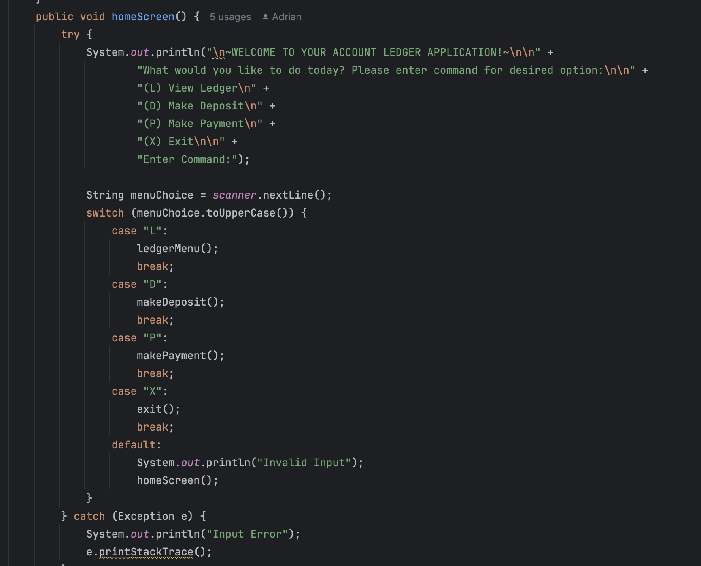
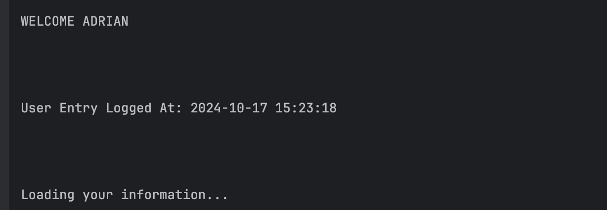
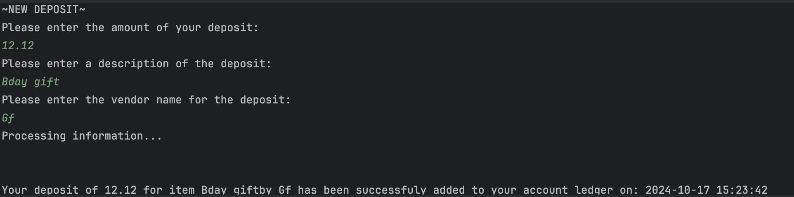
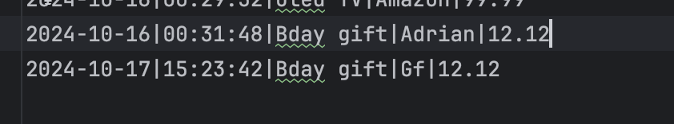
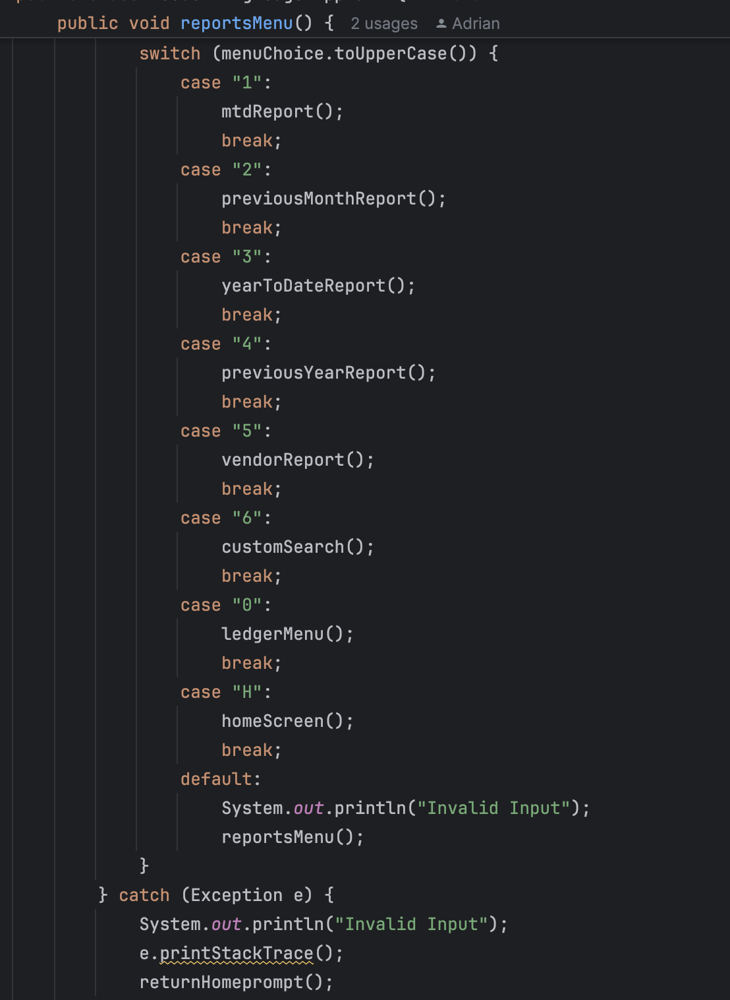
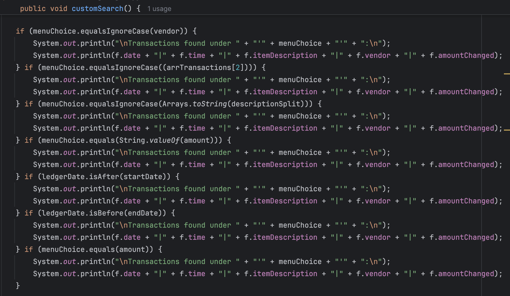
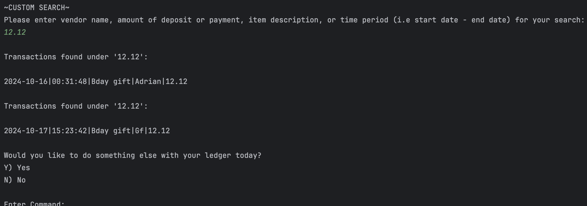

# Capstone Project 

## Accounting Ledger Application
##### Creates and organizes a functional ledger that can be updated in real time
##### Can filter transaction searches by type, date, and by vendor
##### All main methods incorporate a try-catch in order to process and loop user back to Home Screen in case of invalid inputs

### Home Screen
##### Switch-Case method used to retrieve user input 
##### .toUpperCase ignores invalid inputs in terms of case as long as character is correct
##### Loop triggers in case of errors or out of bounds inputs and refreshes ui so user can try again

### User Login (Favorite Feature)
##### Function to get user's name
##### Displays time and date of login
##### Provides a smoother timing for user navigation
##### Can be defined further to access specified ledgers according to name

### Deposit & Payment
##### Returns user input via scanner method
##### Outputs as formatted new transaction in user ledger
##### Similar functions utilized for both deposits and payments tailored to their respective type of transaction
 

### Ledger Reports Menu
##### Switch-Case method utilized to receive user-input and output the method of corresponding command
##### Try and catch method for user inputs that do not correspond
##### Return-Home method implemented to loop user back to home or exit application in case of invalid input

### Month To Date Ledger Report
##### Method reads provided ledger or transaction file
##### Sorts deposits and payments by current month 
##### Utilizes Thread.sleep function to control UI pacing and make user experience more comprehensive
##### Return-Home method implemented to loop user back to home or exit application in case of invalid input

### Year To Date Ledger Report
##### Similar method to mtd report 
##### Sorts a filters transactions according to current year
##### Return-Home method implemented to loop user back to home or exit application in case of invalid input

### Custom Search 
##### IF method used to filter user input 
##### Determines type of search according to input 
##### Finds transactions that best matches input by utilizing array and split functions nested in while loop 
 

### Notes, Afterthoughts, & Reflection 
#### Creating more classes to split methods into different files instead of compiling all in one 
#### Make more methods for repetitive code i.e FileReader and BufferedReader 
#### Instantiating a new scanner for all methods that include it and closing it in each, for runner memory efficiency
#### Implementing more types of methods and classes such as ArrayLists, Hashmaps, For Loops 

